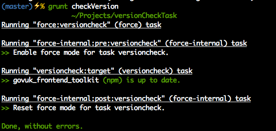
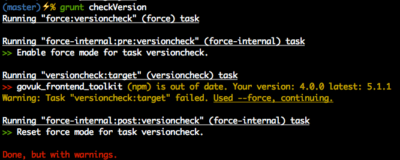

Grunt Dependency Version Check For Build Tasks
=============================================

This repository contains a working Grunt task together with example `package.json` designed for incorporation into UK Government projects that rely on the [govuk frontend toolkit](://github.com/alphagov/govuk_frontend_toolkit).

Running the command `$ grunt checkVersion` will produce the following result if your dependency or dependencies are up to date



And the following if you are out of date



Installation
-----------

To install simply clone this repository into your chosen directory then:
```
cd versionCheckTask
```

```
npm install
```

```
grunt versioncheck
```

Modification, Extension and Gerneral Information
-----------------------------------------------

This example has been setup with two tasks. The first `grunt versioncheck` will check the version of dependencies specified in the `package.json` and will exit with an error code when one is out of date. The second `grunt checkVersion` will notify the user whether the dependency is in or out of date but will not cause the task to exit if the dependency is out of date. This is particularly useful when including this task as part of a projects build scripts.

By default the task will check all project dependencies specified in your project's `package.json` to skip this add the name of the dependecy to the `skip` array held under the versioncheck task.
